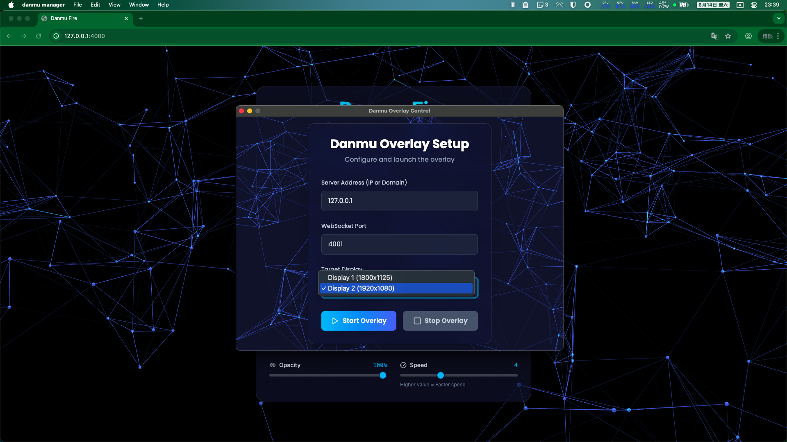

# danmu-desktop

在桌面直接顯示彈幕


## 概述

此專案分為兩個部分：

1. Danmu-Desktop
   - 客戶端應用程式，在您的電腦上運行以顯示彈幕
   - 目前支援 Windows 和 MacOS
   - 提供安裝版和可攜式版本




1. Server
   - 創建網頁界面用於彈幕輸入
   - 管理彈幕傳送到已連接的客戶端
   - 包含管理員配置面板


## 安裝與使用

### Danmu-Desktop 客戶端

1. 下載[最新版本](https://github.com/guan4tou2/danmu-desktop/releases)
2. MacOS 用戶需要執行：
   ```bash
   sudo xattr -r -d com.apple.quarantine 'danmu manager.app'
   ```
3. 啟動應用程式
4. 輸入伺服器的 IP 和端口（預設：4001）

### 伺服器設置

#### 選項 1：Docker Compose（推薦）

1. 克隆專案：

   ```bash
   git clone https://github.com/guan4tou2/danmu-desktop
   cd danmu-desktop
   ```

2. 配置環境變數：

   ```bash
   cp env.example .env
   # 編輯 .env 設定管理員密碼和其他選項
   ```

3. 啟動服務：

   ```bash
   docker-compose up -d
   ```

4. 使用 Redis 進行速率限制（可選）：
   ```bash
   docker-compose --profile redis up -d
   ```

#### 選項 2：手動設置

1. 克隆專案：

   ```bash
   git clone https://github.com/guan4tou2/danmu-desktop
   cd danmu-desktop
   ```

2. 配置環境：

   ```bash
   cp env.example .env
   vim .env  # 設定管理員密碼和其他選項
   ```

3. 設置虛擬環境並安裝依賴：

   ```bash
   cd server
   uv venv
   uv sync
   ```

4. 啟動伺服器（HTTP + WebSocket）：

   ```bash
   # 終端 1：HTTP 伺服器
   PYTHONPATH=.. uv run python -m server.app

   # 終端 2：WebSocket 伺服器
   PYTHONPATH=.. uv run python -m server.ws_app
   ```

詳細部署說明請參考 [DEPLOYMENT.md](DEPLOYMENT.md)

### 訪問伺服器

- 主界面：`http://ip:4000`
- 管理面板：`http://ip:4000/admin`

## 測試與覆蓋率

- 執行測試：`make test` 或 `make test-verbose`
- 產生覆蓋率報告：`make coverage`
  - 終端會顯示 `coverage report`
  - HTML 報告位於 `server/htmlcov/index.html`

## 端口配置

- `4000`：網頁界面
- `4001`：Danmu Desktop 客戶端連接

## 參考資料

SAO UI 設計參考自 [SAO-UI-PLAN-LINK-START | Akilar の糖果屋](https://akilar.top/posts/1b4fa1dd/)
