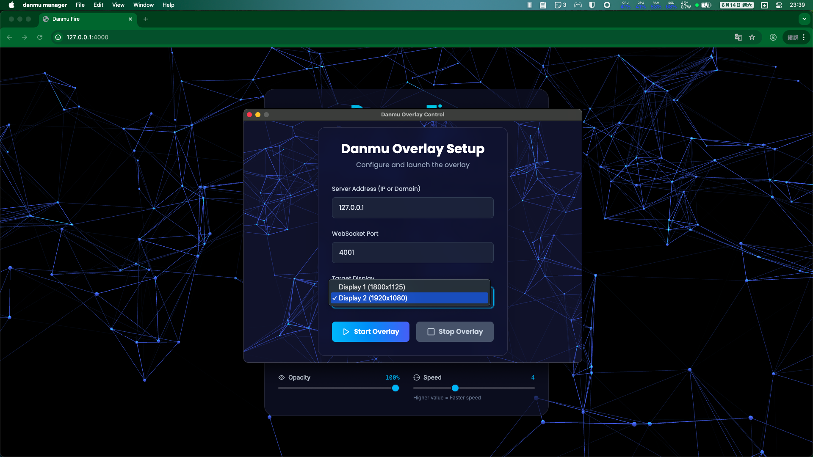
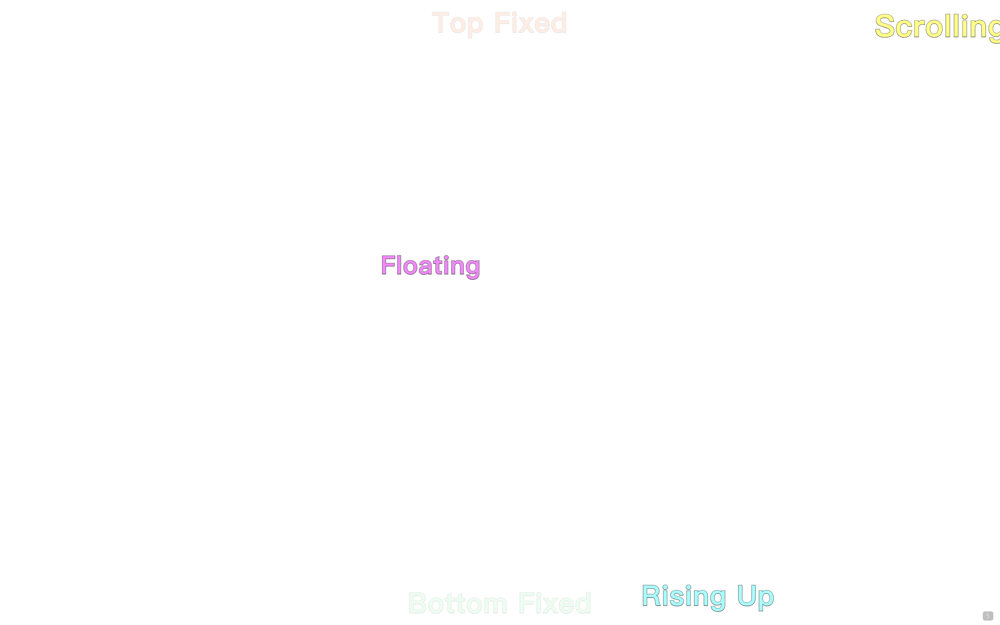

# danmu-desktop

在桌面直接顯示彈幕


## 概述

此專案分為兩個部分：

1. Danmu-Desktop
   - 客戶端應用程式，在您的電腦上運行以顯示彈幕
   - 支援 Windows、MacOS 和 Linux
   - 提供安裝版和可攜式版本
   - 從 GitHub Releases 自動更新




2. Server
   - 創建網頁界面用於彈幕輸入
   - 管理彈幕傳送到已連接的客戶端
   - 包含管理員配置面板、來源指紋記錄與歷史追蹤
   - OBS Browser Source 覆蓋層（`/overlay` 路由）
   - 插件 SDK 支援伺服器端擴展
   - 四語介面（EN、ZH、JA、KO）


## 功能特色

### 佈局模式

支援五種彈幕顯示佈局：捲動（右至左）、頂部固定、底部固定、浮動（隨機位置）、上升（由下至上）。



### 特效與樣式

內建動畫特效（旋轉、彈跳、彩虹、發光、抖動、波浪、閃爍、縮放），每個特效可調參數。支援暱稱、自訂顏色、文字描邊/陰影，以及多特效疊加。


### 熱插拔特效 (.dme)

將 `.dme` 檔案（YAML 格式）放入 `server/effects/` 目錄即可新增自訂特效，5 秒內自動偵測載入。可在管理面板中編輯和管理特效。

### 樣式主題

預定義視覺主題（預設、霓虹、復古、電影），一鍵切換顏色、描邊、陰影和特效組合。可在管理面板或使用者頁面切換主題。

### 互動投票

管理員建立 2-6 個選項的投票。觀眾透過發送選項代號（A/B/C）作為彈幕來投票。即時結果顯示在覆蓋層上，包含即時票數統計。

### 覆蓋層小工具

在 OBS 覆蓋層上新增持久的計分板、跑馬燈和標籤。從管理面板管理位置、樣式和內容。小工具透過 WebSocket 廣播至所有已連接的覆蓋層客戶端。

### OBS Browser Source

使用 `http://your-server:4000/overlay` 作為 OBS Browser Source，無需 Electron 即可顯示彈幕。透明背景，透過 WebSocket 自動連接。

### 插件 SDK

建立伺服器端插件，可對彈幕事件做出反應、修改訊息、過濾內容和自動回覆。每 5 秒熱載入。詳見[插件開發指南](server/PLUGIN_GUIDE.md)。

### 時間軸匯出

將即時彈幕場次錄製為 JSON 時間軸，供離線回放或分析使用。可從管理面板操作。

## 安裝與使用

### Danmu-Desktop 客戶端

1. 下載[最新版本](https://github.com/guan4tou2/danmu-desktop/releases)
2. MacOS 用戶需要執行：
   ```bash
   sudo xattr -r -d com.apple.quarantine 'Danmu Desktop.app'
   ```
3. 啟動應用程式
4. 輸入伺服器的 IP 和端口（預設：4001）

### 伺服器設置

#### 選項 1：使用 GitHub Container Registry 映像（推薦）

1. 直接拉取並啟動映像（請替換密碼）：
   ```bash
   docker run -d --name danmu-server \
     -p 4000:4000 \
     -p 4001:4001 \
     -e ADMIN_PASSWORD=your_secure_password \
     -v danmu_fonts:/app/server/user_fonts \
     -v danmu_static:/app/server/static \
     -v danmu_logs:/app/server/logs \
     ghcr.io/guan4tou2/danmu-server:latest
   ```
   - 也可改用 bcrypt 雜湊避免明文：
     - 產生雜湊：`python server/scripts/hash_password.py`
     - 設定 `-e ADMIN_PASSWORD_HASHED='<bcrypt-hash>'`
   - 伺服器啟動時至少必須提供 `ADMIN_PASSWORD` 或 `ADMIN_PASSWORD_HASHED` 其中一個。
   - 建置的映像支援 `linux/amd64` 與 `linux/arm64/v8`
   - 可用標籤：
     - `latest`：`main` 分支的穩定版本
     - `main`：永遠指向最新的 `main` commit
     - `<git-sha>`：對應特定 commit 的不可變版本（可在 CI log 查看）
2. 建議加入 `--restart unless-stopped` 讓服務自動重啟。
3. 更新版本只需重新拉取並重建：
   ```bash
   docker pull ghcr.io/guan4tou2/danmu-server:latest
   docker stop danmu-server && docker rm danmu-server
   # 重新執行上述 docker run 指令
   ```

#### 選項 2：Docker Compose

1. 下載設定檔（不需 clone 整個 repo）：

   ```bash
   curl -O https://raw.githubusercontent.com/guan4tou2/danmu-desktop/main/docker-compose.yml
   curl -O https://raw.githubusercontent.com/guan4tou2/danmu-desktop/main/.env.example
   ```

2. 配置環境變數：

   ```bash
   cp .env.example .env
   # 編輯 .env，至少設定 ADMIN_PASSWORD 或 ADMIN_PASSWORD_HASHED
   ```

3. 啟動服務（HTTP）：

   ```bash
   docker compose up -d
   ```
   - Nginx 反向代理對外開放 `4000`（HTTP）與 `4001`（WebSocket）。
   - Python server 在 Compose 模式下僅內網可見，由 Nginx 反向代理。

4. 可選 HTTPS / SSL 設定：

   **要用哪種模式？**
   | 情境 | 建議 |
   |------|------|
   | 本機開發 / 同台電腦 | 純 HTTP 即可 |
   | 區域網路 / 內網（`192.168.x.x`） | HTTPS 自簽憑證，不需額外設定 |
   | 公網 IP，無 domain（例如 VPS `1.2.3.4`） | HTTPS 自簽憑證，`.env` 加 `SERVER_IP=1.2.3.4` |
   | 有公開 domain（例如 `danmu.example.com`） | Traefik + Let's Encrypt — 受信任憑證，無瀏覽器警告 |

   **HTTPS — 自簽憑證**（IP 或任意 host，不需 domain）：
   ```bash
   curl -O https://raw.githubusercontent.com/guan4tou2/danmu-desktop/main/docker-compose.https.yml
   mkdir -p nginx/certs
   curl -o nginx/nginx-https.conf https://raw.githubusercontent.com/guan4tou2/danmu-desktop/main/nginx/nginx-https.conf
   docker compose -f docker-compose.yml -f docker-compose.https.yml up -d
   ```
   首次啟動自動產生憑證。若要換成真實憑證，將 `fullchain.pem` / `privkey.pem` 放入 `nginx/certs/` 再重啟。

   **Traefik + Let's Encrypt**（需要公開 domain，且 80 port 可從網際網路連線）：
   ```bash
   curl -O https://raw.githubusercontent.com/guan4tou2/danmu-desktop/main/docker-compose.traefik.yml
   mkdir -p traefik && touch traefik/acme.json && chmod 600 traefik/acme.json
   # 在 .env 設定 DOMAIN=yourdomain.com 與 ACME_EMAIL=you@example.com
   docker compose -f docker-compose.yml -f docker-compose.traefik.yml up -d
   ```
   Traefik 自動申請並續約憑證。

   **Redis 速率限制**（多實例或高流量）：
   ```bash
   curl -O https://raw.githubusercontent.com/guan4tou2/danmu-desktop/main/docker-compose.redis.yml
   # 在 .env 設定 RATE_LIMIT_BACKEND=redis 與 REDIS_URL=redis://redis:6379/0
   docker compose -f docker-compose.yml -f docker-compose.redis.yml up -d
   ```

   覆蓋設定可組合使用，例如 Let's Encrypt + Redis：
   ```bash
   docker compose -f docker-compose.yml -f docker-compose.traefik.yml -f docker-compose.redis.yml up -d
   ```

#### 選項 3：手動設置

1. 克隆專案（僅 server，跳過 Electron client）：

   ```bash
   git clone --filter=blob:none --sparse https://github.com/guan4tou2/danmu-desktop
   cd danmu-desktop
   git sparse-checkout set server .env.example
   ```

   或完整克隆：
   ```bash
   git clone https://github.com/guan4tou2/danmu-desktop
   cd danmu-desktop
   ```

2. 配置環境：

   ```bash
   cp .env.example .env
   vim .env  # 設定管理員密碼和其他選項
   ```

3. 設置虛擬環境並安裝依賴：

   ```bash
   cd server
   uv venv
   uv sync
   ```

4. 啟動伺服器（HTTP + WebSocket）：

   ```bash
   # 終端 1：HTTP 伺服器
   PYTHONPATH=.. uv run python -m server.app

   # 終端 2：WebSocket 伺服器
   PYTHONPATH=.. uv run python -m server.ws_app
   ```

詳細部署說明請參考 [DEPLOYMENT.md](DEPLOYMENT.md)、`docs/README.md` 以及英文版 README。

### 訪問伺服器

- 主界面：`http://ip:4000`
- 管理面板：`http://ip:4000/admin`
- OBS 覆蓋層：`http://ip:4000/overlay`

## 測試與覆蓋率

- 執行測試：`make test` 或 `make test-verbose`
- 產生覆蓋率報告：`make coverage`
  - 終端會顯示 `coverage report`
  - HTML 報告位於 `server/htmlcov/index.html`

## 端口配置

- `4000`：網頁界面（經由反向代理）
- `4001`：Danmu Desktop 客戶端連接（經由反向代理）

## 文件總覽 / Docs
- `README.md`：英文版總覽。
- `docs/README.md`：技術文件索引（English/中文）。
- `DEPLOYMENT.md`：生產部署細節 / Deployment reference。
- `server/PLUGIN_GUIDE.md`：插件 SDK 開發文件。
- `README-CH.md`：中文總覽（本文件）。
- `docs/archive/`：歷史紀錄與整理檔案。

## CI/CD 與 Docker Hub
- `.github/workflows/docker-build.yml` 會在每次 PR / push（main）時建置與測試伺服器映像。
- `.github/workflows/test.yml` 執行 Python 測試（含覆蓋率報告與 `pip-audit` CVE 掃描）。
- `.github/workflows/build.yml` 在版本更新時為 Windows、macOS、Linux 建置 Electron 應用程式，並建立含自動更新中繼資料的 GitHub Releases。
- 於 GitHub Secrets 設定 `DOCKERHUB_USERNAME` 與 `DOCKERHUB_TOKEN`（Docker Hub Access Token），即可在 main 更新時自動推送 `使用者/danmu-server:latest` 與對應 commit SHA 的 Tag。

## 安全備註
- 此 repo 已啟用 GitHub Advanced Security 與 Dependabot。
- OSV 掃描會在 `push`、`pull_request` 與排程任務執行（見 `.github/workflows/osv-scanner.yml`）。
- 前端 lockfile 透過 npm overrides 強制 `serialize-javascript@7.0.3`，對應 `GHSA-5c6j-r48x-rmvq`。
- 專用 WebSocket 預設為 `WS_REQUIRE_TOKEN=false`。若 `4001` 對 localhost 或受信任 LAN 以外的網路可達，任何可到達該埠的客戶端都能連線；請改為啟用 token 驗證，或用反向代理 / 防火牆限制路徑。
- production 啟動現在會拒絕以下不安全設定：未明確設定 `SECRET_KEY`、`SESSION_COOKIE_SECURE=false`、或未設定 `TRUSTED_HOSTS`。部署前請先補齊。
- 目前 app 會送出 nonce-based `Content-Security-Policy` header。之後若新增 inline script，請使用模板提供的 nonce，不要退回 `unsafe-inline`。
- `Strict-Transport-Security` 目前是 opt-in，需明確設定 `HSTS_ENABLED=true`，且只會在 HTTPS 回應上送出。

## 參考資料

SAO UI 設計參考自 [SAO-UI-PLAN-LINK-START | Akilar の糖果屋](https://akilar.top/posts/1b4fa1dd/)
